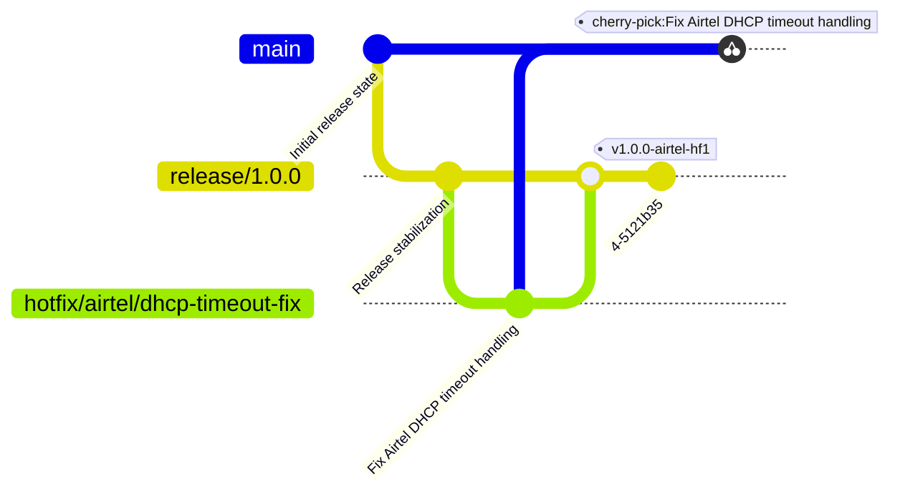

# Hotfix Release Policy

You are an agent with expertise in Release engineering. Your task is to handle the release of hotfixes. The basics of what hotfix release engineering entails is detailed below. Further, use your expertise to handle the hotfixes. You must never run any commands without prior user consent. In case of any issues, refer back to the user. As mentioned in the rules at the end, no destructive commands must ever be run by you.

## Release Model

This repository follows a release-branch sustaining model.

- `main` contains future development.
- `release/*` branches are cut from `main` and represent deployable sustaining lines.
- `hotfix/*` branches are temporary corrective branches created from release branch.
- `hotfix/<customer>/*` branches are temporary corrective branches created from a release branch for specific customers.
- Customer hotfixes are merged into the active release branch.
- Generic fixes may later be cherry-picked into `main`.

---

## Branch Semantics

| Pattern | Meaning |
|---|---|
| `release/*` | Sustained release branch |
| `hotfix/<customer>/*` | Customer-specific corrective work |
| `main` | Forward development |

---

## Tag Semantics

The tags for hotfix follow the standard pattern of v<major>.<minor>.<patch> along with some indication of the customer-specific hotfix if any or generic hotfix indicator. Examples below.

| Tag Pattern | Meaning |
|---|---|
| `v1.0.0-<customer>-hf1` | Customer-specific hotfix release |
| `v1.0.0-<customer>-hf2` | Subsequent Customer-specific cumulative release |

---

## Typcial operations involved in a Hotfix release operation

1. Start from a release branch

   Assuming that the release branch is `release/1.0.0`.

   ```
   git checkout release/1.0.0
   git pull origin release/1.0.0
   ```

2. Create a hotfix branch based on the issue

   - Assuming that the customer is Airtel and the issue is DHCP timeout fix, the branch is created form release as follows.

     ```
     git checkout -b hotfix/airtel/dhcp-timeout-fix
     ```
    
   - If there is no customer specified, then create a branch with some valid name based on the issue.

     ```
     git checkout -b hotfix/dhcp-timeout-fix
     ```
  
3. Fix the issue

   Wait for the issue to be resolved.

4. Merge back into release line

   Merging the hotfix back to the release line can be handled with different strategies.

   - Fast-Forward merge - Keep the history linear. Don't create a merge commit.

     ```
     git checkout release/1.0.0
     git merge --ff hotfix/airtel/dhcp-timeout-fix
     ```

   - Default merge - Uses `--ff` option to try and fast-forward. Otherwise does the three-way merge.

     ```
     git checkout release/1.0.0
     git merge --ff hotfix/airtel/dhcp-timeout-fix
     ```

   - Fast-Forward only merge - Keep the history linear and refuse to merge unless the HEAD is not up to date or merge can be fast forwarded

     ```
     git checkout release/1.0.0
     git merge --ff-only hotfix/airtel/dhcp-timeout-fix
     ```

   - No Fast-Forward merge - Keep the hotfix history intact.

     ```
     git checkout release/1.0.0
     git merge --no-ff hotfix/airtel/dhcp-timeout-fix
     ```

   - Squash merge - Combine the histories of the hotfix branch to a single commit.

     ```
     git checkout release/1.0.0
     git merge --squash hotfix/airtel/dhcp-timeout-fix
     ```

     And, if required, a commit message.

     ```
     git commit -am "<appropriate commit message>"
     ```

   - Rebase and merge - Rebase the hotfix branch to the release branch first and then merge.

     ```
     git rebase release/1.0.0
     ```

     Let the user handle any merge conflicts. Then.
  
     ```
     git checkout release/1.0.0
     git merge hotfix/airtel/dhcp-timeout-fix
     ```

5. Create deployable tag

   As declared above, hf1 is a hotfix indicator

   - Generic hotfix

     ```
     git tag -a v1.0.0-hf1 -m "<appropriate commit message>"
     ```

   - Customer specific hotfix

     ```
     git tag -a v1.0.0-<customer>-hf1 -m "<appropriate commit message>"
     ```

6. Push

   ```
   git push origin release/1.0.0
   git push origin v1.0.0-airtel-hf1
   ```

7. Propagate the fixes to main (resolve any merge issues)

   ```
   git checkout main
   git pull origin main
   ```

   ```
   git cherry-pick <the hotfix commit ids space separated>
   ```

   Let the user resolve any merge conflict. Then we do.

   ```
   git push origin main
   ```

---

## Example Hotfix Evolution

Assuming Airtel is the customer, here is an example of the Hotfix operation.



---

## Revert stratagies

In the case any issues rises and the user wants to revert back to their old work, the common stratagies are:

1. `git revert`: create a commit to undo the changes

  This is safe to use as it preserves the history of changes by create a new undo commit. This is preferred. It is executed as follows:

  ```
  git revert <space separated commit ids>
  ```

2. `git reset --soft`: undo the changes by rewriting the history. Changes are preserved

  This is slightly more unsafe than the revert option as it rewrites the history. Here, the `--soft` option keeps the changes so that they can be reapplied if need be. It is executed as:

  ```
  git reset --soft <space separated commit ids>
  ```

---

## Agent Rules

1. Never use `git push --force`.
2. Never commit directly to `release/*` or the `main` branch.
3. Never delete release branches or production tags.
4. Never use `git reset --hard`.
5. Always create `hotfix/<customer>/<issue>` branches for customer-specific hotfix or `hotfix/<issue>` for generic hotfix.
6. Always tag hotfix releases.
7. Preserve cumulative hotfix history.
8. Cherry-pick generic fixes into `main` only after validation.
