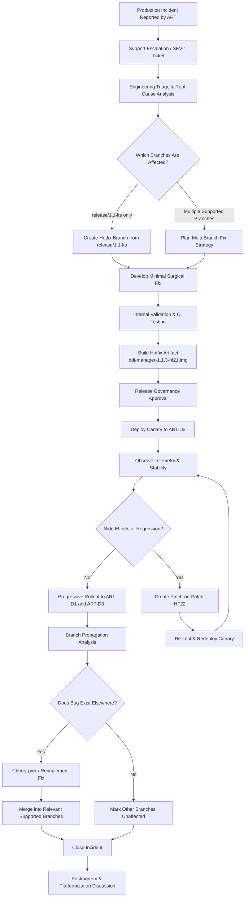
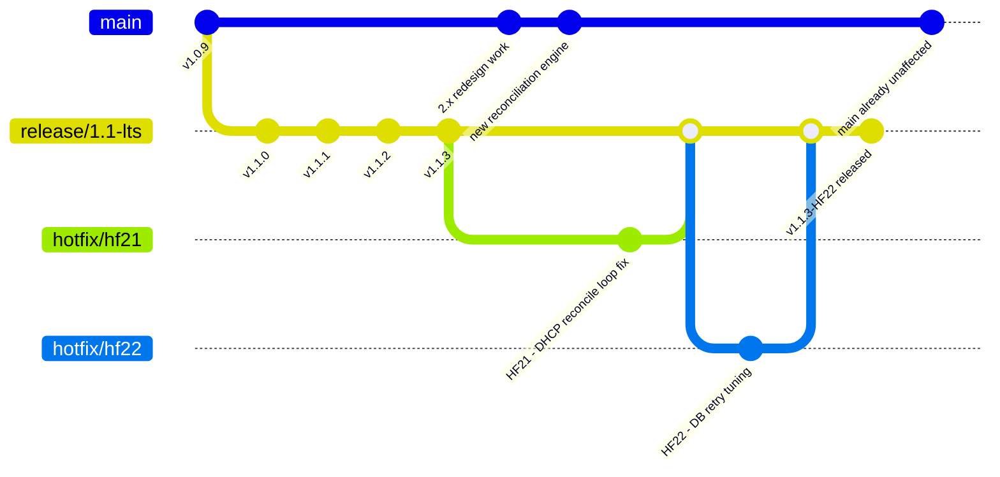

# HotFix LifeCycle for Model 1

## Premise

Bitloka provides a telecom-style appliance product called ddi-manager for managing:

DNS (Domain Name System)
DHCP (Dynamic Host Configuration Protocol)
IPAM (IP Address Management)

The product runs as customer-managed VM appliances deployed across telecom environments.

Customers:

- AIR → Airtel
- REL → Reliance
- TAT → Tata

Devices per customer: D1, D2, D3

Customers operate multiple devices and require:

- staged rollouts
- canary deployments
- customer certification
- rolling upgrades
- controlled hotfix deployment

## Model description

### Model 1 - GitFlow / Release Branch Model

This scenario follows a traditional enterprise GitFlow-style workflow.

The repository contains:

- `main` for stable production-ready history
- `develop` for ongoing feature integration
- `release/x.y` branches for release stabilization
- temporary `hotfix/*` branches for emergency production fixes

When a production issue occurs, the hotfix is created from the affected release branch, validated internally, deployed gradually to customer devices, and then propagated back into both:

- the release branch
- the forward-moving development line (`develop` and eventually `main`)

This model prioritizes:

- release isolation
- controlled stabilization
- predictable maintenance workflows

## States

### State Before the Fix

At the time of the incident:

| Customer | Devices                | Version | Status                                        |
| -------- | ---------------------- | ------- | --------------------------------------------- |
| AIR      | AIR-D1, AIR-D2, AIR-D3 | v1.1.3  | DHCP outage occurring on AIR-D2               |
| REL      | REL-D1, REL-D2, REL-D3 | v1.0.x  | Unaffected                                    |
| TAT      | TAT-D1, TAT-D2, TAT-D3 | v1.1.1  | Potentially vulnerable but issue not observed |

Engineering determines:

- the defect exists only in the `release/1.1` line
- the issue was introduced during DHCP reconciliation optimization work
- main already contains a redesigned reconciliation engine and is unaffected

### State After the Fix

After HF21 and HF22 rollout:

| Customer | Devices                | Final Version | Status                               |
| -------- | ---------------------- | ------------- | ------------------------------------ |
| ART      | AIR-D1, AIR-D2, AIR-D3 | v1.1.3-HF22   | Stable after staged rollout          |
| REL      | REL-D1, REL-D2, REL-D3 | v1.0.x        | No action required                   |
| TAT      | TAT-D1, TAT-D2, TAT-D3 | v1.1.1        | Advisory issued for optional upgrade |

Release engineering actions:

- HF21/HF22 merged into `release/1.1`
- fixes propagated into `develop`
- future releases inherit the fix through normal release flow
- no merge required into `main` because architecture there already differs

## Hotfix Lifecycle Flowchart

