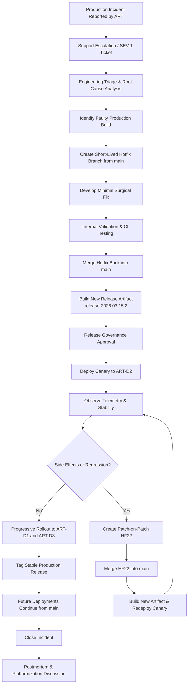
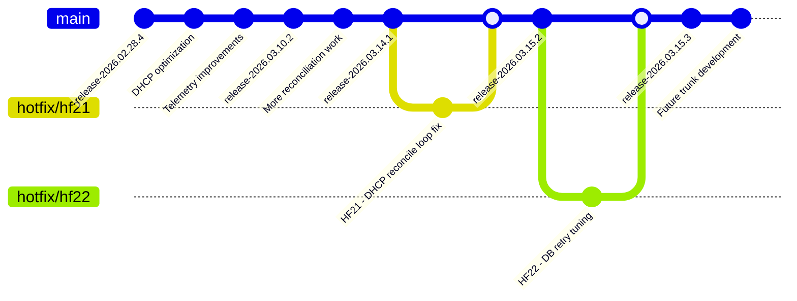

# HotFix LifeCycle for Model 2

## Premise

Bitloka provides a telecom-style appliance product called ddi-manager for managing:

DNS (Domain Name System)
DHCP (Dynamic Host Configuration Protocol)
IPAM (IP Address Management)

The product runs as customer-managed VM appliances deployed across telecom environments.

Customers:

- AIR → Airtel
- REL → Reliance
- TAT → Tata

Devices per customer: D1, D2, D3

Customers operate multiple devices and require:

staged rollouts
canary deployments
customer certification
rolling upgrades
controlled hotfix deployment

## Model description

### Model 2 - Trunk-Based Development Model

This scenario follows a trunk-based development workflow.

The repository primarily contains:

- `main` as the single continuously integrated trunk
- short-lived feature or hotfix branches
- release artifacts generated directly from commits/tags on `main`

There are no long-lived `release/x.y` branches. Instead, all fixes are applied directly onto `main`, validated quickly, and released as new immutable build artifacts.

When a production issue occurs, the hotfix is developed against the current trunk, validated internally, deployed gradually to customer devices, and then rolled forward through progressively newer release artifacts.

This model prioritizes:

- rapid integration
- reduced branch divergence
- continuous delivery
- simplified branch topology

## States

### State Before the Fix

At the time of the incident:

| Customer | Devices                | Version              | Status                                        |
| -------- | ---------------------- | -------------------- | --------------------------------------------- |
| AIR      | AIR-D1, AIR-D2, AIR-D3 | release-2026.03.14.1 | DHCP outage occurring on AIR-D2               |
| REL      | REL-D1, REL-D2, REL-D3 | release-2026.02.28.4 | Older stable deployment, unaffected           |
| TAT      | TAT-D1, TAT-D2, TAT-D3 | release-2026.03.10.2 | Potentially vulnerable but issue not observed |

Engineering determines:

- the defect exists in the current production trunk build
- the issue was introduced during DHCP reconciliation optimization work
- all future releases from `main` will inherit the bug unless fixed immediately

### State After the Fix

After HF21 and HF22 rollout:

| Customer | Devices                | Final Version        | Status                               |
| -------- | ---------------------- | -------------------- | ------------------------------------ |
| AIR      | AIR-D1, AIR-D2, AIR-D3 | release-2026.03.15.3 | Stable after staged rollout          |
| REL      | REL-D1, REL-D2, REL-D3 | release-2026.02.28.4 | No action required                   |
| TAT      | TAT-D1, TAT-D2, TAT-D3 | release-2026.03.10.2 | Advisory issued for optional upgrade |

Release engineering actions:

- HF21/HF22 committed directly into `main`
- new release artifacts generated from updated trunk
- future deployments automatically inherit the fix
- no branch propagation required due to single-trunk workflow

## Hotfix Lifecycle Flowchart

