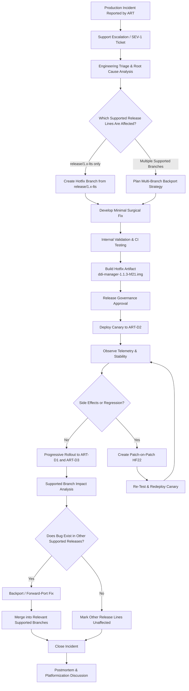
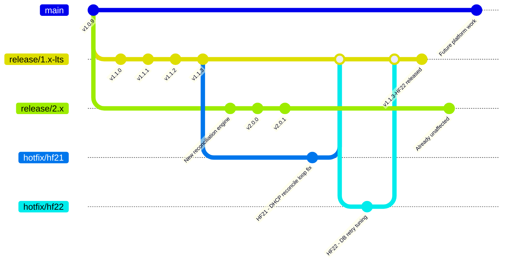

# HotFix LifeCycle for Model 3

## Premise

Bitloka provides a telecom-style appliance product called ddi-manager for managing:

DNS (Domain Name System)
DHCP (Dynamic Host Configuration Protocol)
IPAM (IP Address Management)

The product runs as customer-managed VM appliances deployed across telecom environments.

Customers:

AIR → Airtel
REL → Reliance
TAT → Tata

Devices per customer: D1, D2, D3

Customers operate multiple devices and require:

staged rollouts
canary deployments
customer certification
rolling upgrades
controlled hotfix deployment

## Model description

### Model 3 - LTS + Current Release Model

This scenario follows an LTS (Long-Term Support) plus current release workflow.

The repository contains:

- `main` for future platform development
- `release/2.x` for the actively evolving current release line
- `release/1.x-lts` for long-term supported production deployments

Only selected release lines receive long-term maintenance support. Older supported customers remain on the LTS branch while newer customers gradually adopt the current release line.

When a production issue occurs, release engineering determines:

- which supported branches are affected
- whether the fix must be backported or forward-ported
- whether some branches are already unaffected due to architectural changes

This model prioritizes:

- long-term customer stability
- controlled maintenance streams
- selective hotfix propagation
- predictable enterprise support lifecycles

## States

### State Before the Fix

At the time of the incident:

| Customer | Devices                | Version | Status                                        |
| -------- | ---------------------- | ------- | --------------------------------------------- |
| AIR      | AIR-D1, AIR-D2, AIR-D3 | v1.1.3  | DHCP outage occurring on AIR-D2               |
| REL      | REL-D1, REL-D2, REL-D3 | v1.0.9  | Older LTS deployment, unaffected              |
| TAT      | TAT-D1, TAT-D2, TAT-D3 | v2.0.1  | Current release line, issue not reproduced    |

Engineering determines:

- the defect exists only in the `release/1.x-lts` line
- the issue was introduced during DHCP reconciliation optimization work
- `release/2.x` already contains a redesigned reconciliation engine and is unaffected
- REL remains on older supported LTS infrastructure

### State After the Fix

After HF21 and HF22 rollout:

| Customer | Devices                | Final Version | Status                               |
| -------- | ---------------------- | ------------- | ------------------------------------ |
| AIR      | AIR-D1, AIR-D2, AIR-D3 | v1.1.3-HF22   | Stable after staged rollout          |
| REL      | REL-D1, REL-D2, REL-D3 | v1.0.9        | No action required                   |
| TAT      | TAT-D1, TAT-D2, TAT-D3 | v2.0.1        | Already unaffected                   |

Release engineering actions:

- HF21/HF22 merged into `release/1.x-lts`
- no backport required into `release/1.0.x`
- no forward-port required into `release/2.x`
- main already inherited redesigned architecture from current release line

## Hotfix Lifecycle Flowchart

