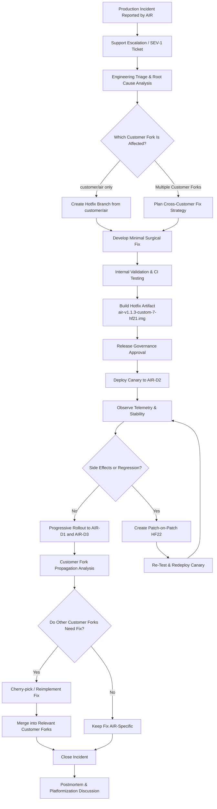
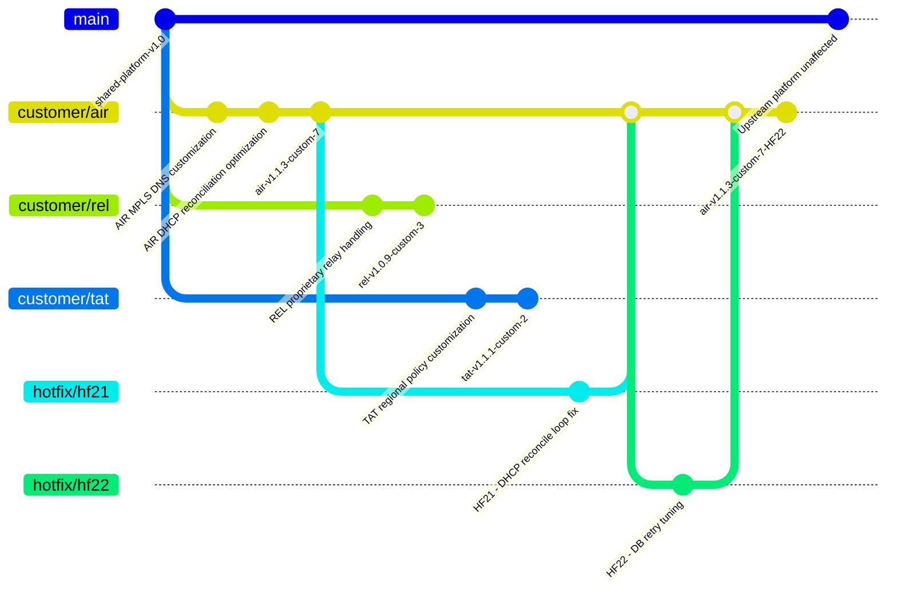

# HotFix LifeCycle for Model 4

## Premise

Bitloka provides a telecom-style appliance product called ddi-manager for managing:

DNS (Domain Name System)
DHCP (Dynamic Host Configuration Protocol)
IPAM (IP Address Management)

The product runs as customer-managed VM appliances deployed across telecom environments.

Customers:

- AIR → Airtel
- REL → Reliance
- TAT → Tata

Devices per customer: D1, D2, D3

Customers operate multiple devices and require:

staged rollouts
canary deployments
customer certification
rolling upgrades
controlled hotfix deployment

## Model description

### Model 4 - Customer Fork / Vendor Branch Model

This scenario follows a customer fork / vendor branch workflow commonly used in telecom, embedded systems, and appliance vendors.

The repository contains:

- `main` for the shared upstream platform
- customer-specific branches such as:
  - `customer/air`
  - `customer/rel`
  - `customer/tat`
- selective upstream synchronization between customer branches and the shared platform

Each customer branch may contain:

- customer-specific integrations
- telecom-specific workflows
- proprietary protocol behavior
- deployment-specific modifications

When a production issue occurs, the hotfix is first applied to the affected customer branch. Release engineering then determines whether the fix should:

- remain customer-specific
- be generalized and upstreamed
- be propagated into other customer forks

This model prioritizes:

- customer flexibility
- deployment-specific customization
- contractual feature isolation
- independent customer release cadence

## States

### State Before the Fix

At the time of the incident:

| Customer | Devices                | Version              | Status                                        |
| -------- | ---------------------- | -------------------- | --------------------------------------------- |
| AIR      | AIR-D1, AIR-D2, AIR-D3 | air-v1.1.3-custom-7  | DHCP outage occurring on AIR-D2               |
| REL      | REL-D1, REL-D2, REL-D3 | rel-v1.0.9-custom-3  | Running separate customer fork, unaffected    |
| TAT      | TAT-D1, TAT-D2, TAT-D3 | tat-v1.1.1-custom-2  | Different customization path, issue not seen  |

Engineering determines:

- the defect exists only in the `customer/air` branch
- the issue was introduced during AIR-specific DHCP reconciliation customization work
- neither REL nor TAT forks contain the same reconciliation modifications
- main upstream platform is unaffected

### State After the Fix

After HF21 and HF22 rollout:

| Customer | Devices                | Final Version             | Status                               |
| -------- | ---------------------- | ------------------------- | ------------------------------------ |
| AIR      | AIR-D1, AIR-D2, AIR-D3 | air-v1.1.3-custom-7-HF22  | Stable after staged rollout          |
| REL      | REL-D1, REL-D2, REL-D3 | rel-v1.0.9-custom-3       | No action required                   |
| TAT      | TAT-D1, TAT-D2, TAT-D3 | tat-v1.1.1-custom-2       | No action required                   |

Release engineering actions:

- HF21/HF22 merged only into `customer/air`
- no propagation required into REL or TAT customer forks
- no upstream merge into `main`
- postmortem initiated to evaluate whether AIR-specific logic should be generalized into a reusable platform capability

## Hotfix Lifecycle Flowchart

