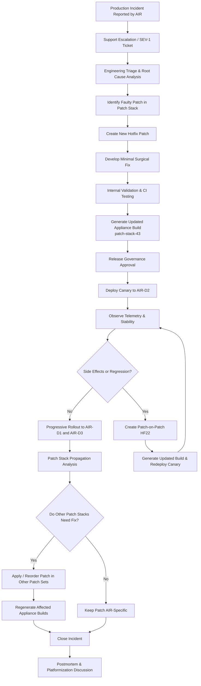
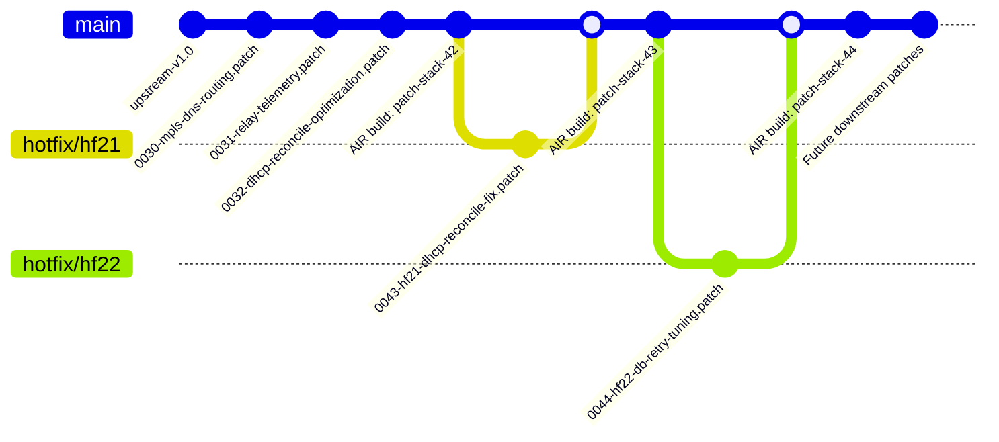

# HotFix LifeCycle for Model 5

## Premise

Bitloka provides a telecom-style appliance product called ddi-manager for managing:

DNS (Domain Name System)
DHCP (Dynamic Host Configuration Protocol)
IPAM (IP Address Management)

The product runs as customer-managed VM appliances deployed across telecom environments.

Customers:

- AIR → Airtel
- REL → Reliance
- TAT → Tata

Devices per customer: D1, D2, D3

Customers operate multiple devices and require:

- staged rollouts
- canary deployments
- customer certification
- rolling upgrades
- controlled hotfix deployment

## Model description

### Model 5 - Patch Stack / Quilt Model

This scenario follows a patch stack / quilt-style workflow commonly used in Linux distributions, embedded systems, networking firmware, and appliance vendors.

The repository contains:

- a shared upstream platform source tree
- an ordered patch series applied during build time
- customer-specific and operational patches maintained independently from upstream history

Instead of maintaining many long-lived branches, the system evolves through:

- patch queues
- patch layering
- ordered patch application
- selective patch enablement per customer build

When a production issue occurs, the hotfix is introduced as a new patch in the patch stack. Release engineering then determines whether the patch should:

- remain customer-specific
- become a shared operational patch
- eventually be upstreamed into the core platform

This model prioritizes:

- explicit patch traceability
- controlled downstream modifications
- minimal branch divergence
- reproducible appliance builds

## States

### State Before the Fix

At the time of the incident:

| Customer | Devices                | Version                    | Status                                        |
| -------- | ---------------------- | -------------------------- | --------------------------------------------- |
| AIR      | AIR-D1, AIR-D2, AIR-D3 | v1.1.3 + patch-stack-42    | DHCP outage occurring on AIR-D2               |
| REL      | REL-D1, REL-D2, REL-D3 | v1.0.9 + rel-patchset-18   | Running different patch stack, unaffected     |
| TAT      | TAT-D1, TAT-D2, TAT-D3 | v1.1.1 + tat-patchset-11   | Potentially vulnerable but issue not observed |

Engineering determines:

- the defect was introduced by patch `0032-dhcp-reconcile-optimization.patch`
- the issue exists only in AIR’s operational patch stack
- REL and TAT builds use different downstream patch compositions
- upstream source tree itself is unaffected

### State After the Fix

After HF21 and HF22 rollout:

| Customer | Devices                | Final Version                      | Status                               |
| -------- | ---------------------- | ---------------------------------- | ------------------------------------ |
| AIR      | AIR-D1, AIR-D2, AIR-D3 | v1.1.3 + patch-stack-44            | Stable after staged rollout          |
| REL      | REL-D1, REL-D2, REL-D3 | v1.0.9 + rel-patchset-18           | No action required                   |
| TAT      | TAT-D1, TAT-D2, TAT-D3 | v1.1.1 + tat-patchset-11           | No action required                   |

Release engineering actions:

- added `0043-hf21-dhcp-reconcile-fix.patch`
- added `0044-hf22-db-retry-tuning.patch`
- AIR appliance builds regenerated using updated patch stack
- postmortem initiated to determine whether reconciliation behavior should move into configurable runtime policies

## Hotfix Lifecycle Flowchart

