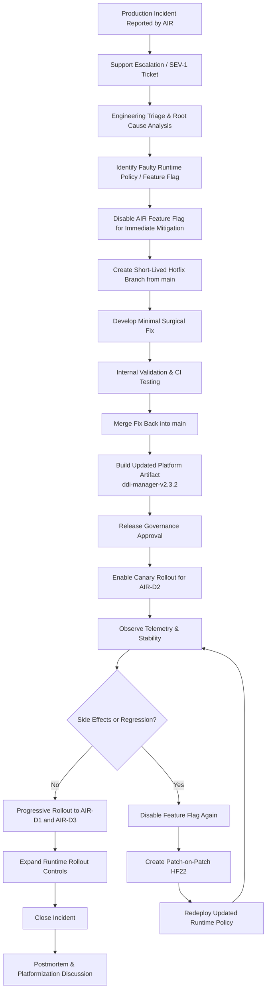
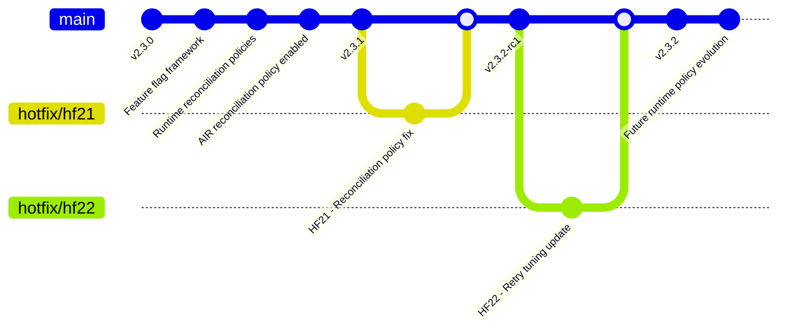

# HotFix LifeCycle for Model 6

## Premise

Bitloka provides a telecom-style appliance product called ddi-manager for managing:

DNS (Domain Name System)
DHCP (Dynamic Host Configuration Protocol)
IPAM (IP Address Management)

The product runs as customer-managed VM appliances deployed across telecom environments.

Customers:

- AIR → Airtel
- REL → Reliance
- TAT → Tata

Devices per customer: D1, D2, D3

Customers operate multiple devices and require:

- staged rollouts
- canary deployments
- customer certification
- rolling upgrades
- controlled hotfix deployment

## Model description

### Model 6 - Feature Flag / Runtime Variability Model

This scenario follows a feature flag and runtime variability workflow commonly used in modern SaaS platforms and extensible enterprise systems.

The repository primarily contains:

- a shared unified codebase on `main`
- runtime configuration systems
- feature flags
- policy engines
- customer-specific behavior controlled through configuration rather than source divergence

Instead of maintaining customer-specific branches or patch stacks, the platform introduces customer variability through:

- runtime policy evaluation
- feature toggles
- plugin interfaces
- tenant-specific configuration

When a production issue occurs, release engineering determines whether the fix requires:

- a shared code patch
- a runtime configuration change
- a feature rollback
- selective customer targeting through rollout controls

This model prioritizes:

- minimal branch divergence
- centralized platform evolution
- scalable customer customization
- operational rollout flexibility

## States

### State Before the Fix

At the time of the incident:

| Customer | Devices                | Version | Status                                        |
| -------- | ---------------------- | ------- | --------------------------------------------- |
| AIR      | AIR-D1, AIR-D2, AIR-D3 | v2.3.1  | DHCP outage occurring on AIR-D2               |
| REL      | REL-D1, REL-D2, REL-D3 | v2.3.1  | Same shared platform, unaffected              |
| TAT      | TAT-D1, TAT-D2, TAT-D3 | v2.3.1  | Same shared platform, issue not reproduced    |

Engineering determines:

- the defect exists in a newly enabled DHCP reconciliation policy
- the issue is triggered only when the AIR-specific reconciliation feature flag is enabled
- the shared platform codebase is otherwise common across all customers
- REL and TAT do not use the affected runtime policy configuration

### State After the Fix

After HF21 and HF22 rollout:

| Customer | Devices                | Final Version | Status                               |
| -------- | ---------------------- | ------------- | ------------------------------------ |
| AIR      | AIR-D1, AIR-D2, AIR-D3 | v2.3.2        | Stable after staged rollout          |
| REL      | REL-D1, REL-D2, REL-D3 | v2.3.1        | No action required                   |
| TAT      | TAT-D1, TAT-D2, TAT-D3 | v2.3.1        | No action required                   |

Release engineering actions:

- reconciliation policy temporarily disabled for AIR during mitigation
- shared fix committed into `main`
- runtime rollout controlled through feature flags
- AIR-specific reconciliation behavior moved toward policy-driven isolation

## Hotfix Lifecycle Flowchart

