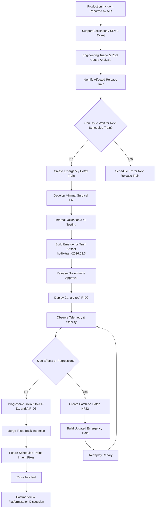
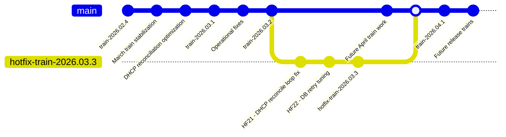

# HotFix LifeCycle for Model 7

## Premise

Bitloka provides a telecom-style appliance product called ddi-manager for managing:

DNS (Domain Name System)
DHCP (Dynamic Host Configuration Protocol)
IPAM (IP Address Management)

The product runs as customer-managed VM appliances deployed across telecom environments.

Customers:

- AIR → Airtel
- REL → Reliance
- TAT → Tata

Devices per customer: D1, D2, D3

Customers operate multiple devices and require:

- staged rollouts
- canary deployments
- customer certification
- rolling upgrades
- controlled hotfix deployment

## Model description

### Model 7 - Immutable Release Train Model

This scenario follows an immutable release train workflow commonly used in large-scale product organizations with predictable scheduled releases.

The repository contains:

- `main` for continuous development
- periodic release train cut points
- immutable train snapshots such as:
  - `train-2026.03`
  - `train-2026.04`
  - `train-2026.05`

Features and fixes move through scheduled release trains. Once a train is stabilized and released, it becomes immutable except for critical emergency patches.

When a production issue occurs, release engineering determines whether the issue should be:

- fixed in the next scheduled train
- addressed through an out-of-band emergency hotfix train
- mitigated operationally until the next rollout window

This model prioritizes:

- predictable release cadence
- operational coordination
- controlled stabilization windows
- organization-wide release discipline

## States

### State Before the Fix

At the time of the incident:

| Customer | Devices                | Version         | Status                                        |
| -------- | ---------------------- | --------------- | --------------------------------------------- |
| AIR      | AIR-D1, AIR-D2, AIR-D3 | train-2026.03.2 | DHCP outage occurring on AIR-D2               |
| REL      | REL-D1, REL-D2, REL-D3 | train-2026.02.4 | Older stable train, unaffected                |
| TAT      | TAT-D1, TAT-D2, TAT-D3 | train-2026.03.1 | Potentially vulnerable but issue not observed |

Engineering determines:

- the defect was introduced during the March release train stabilization cycle
- the issue affects the currently deployed March production train
- the next scheduled release train is still several weeks away
- a dedicated emergency hotfix train is required

### State After the Fix

After HF21 and HF22 rollout:

| Customer | Devices                | Final Version          | Status                               |
| -------- | ---------------------- | ---------------------- | ------------------------------------ |
| AIR      | AIR-D1, AIR-D2, AIR-D3 | hotfix-train-2026.03.3 | Stable after staged rollout          |
| REL      | REL-D1, REL-D2, REL-D3 | train-2026.02.4        | No action required                   |
| TAT      | TAT-D1, TAT-D2, TAT-D3 | train-2026.03.1        | Advisory issued for optional upgrade |

Release engineering actions:

- emergency hotfix train created from March production train
- HF21/HF22 applied into hotfix train branch
- next official release train automatically inherits fixes from `main`
- production rollout coordinated separately from future train schedules

## Hotfix Lifecycle Flowchart

